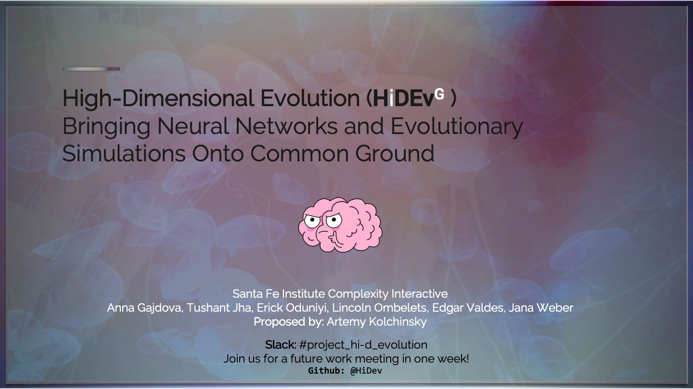
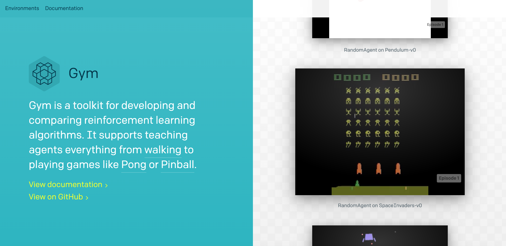
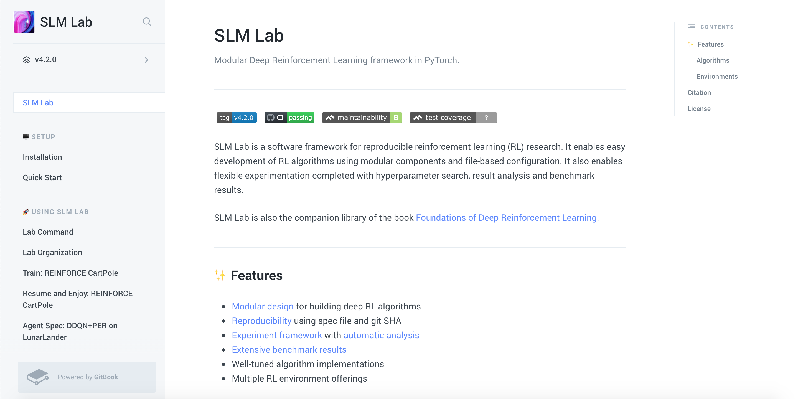

# Project 1: Bringing Neural Networks and Evolutionary Simulations Onto Common Ground
**Team:** _Anna Gajdova, Tushant Jha, Erick Oduniyi, Lincoln Ombelets, Edgar Valdes, Jana Weber, & Artemy Kolchinsky_

---
## 🍿 [Movie](https://www.youtube.com/watch?v=RH_Wl3mXRTc&ab_channel=ErickOduniyi)

---
## 🔭 [SFI-CI](https://www.santafe.edu/engage/learn/courses/complexity-interactive)
### [Abstract](https://storage.googleapis.com/root-proposal-1246/HiD/hi-d_abstract.pdf)
### [Presentation](https://storage.googleapis.com/root-proposal-1246/HiD/hi-d-ev-presentation_final.pdf)

---
## Made with 🤟
### 👁️ [see_hear_proposal](https://www.youtube.com/watch?v=_7WwdfxD6RQ&ab_channel=ErickOduniyi)🦻
#### 🦻 [hear_proposal](https://storage.googleapis.com/root-proposal-1246/HiD/spoken_proposal.mp3) 
### 👁️ [see_hear_presentation](https://www.youtube.com/watch?v=RH_Wl3mXRTc&ab_channel=ErickOduniyi)🦻
#### 🦻 [hear_presentation](https://storage.googleapis.com/root-proposal-1246/HiD/spoken_presentation.mp3) 

---
### [Experiments with OpenAI Gym, Processing, and SLM](https://github.com/Hi-Di-Gr/Hi_D_Ev)

---
> **Ack:** _SFI, SFI-CI participants (staff/students), MOTHER/GOD_

_làtom,_ 
_HiDev Group_
